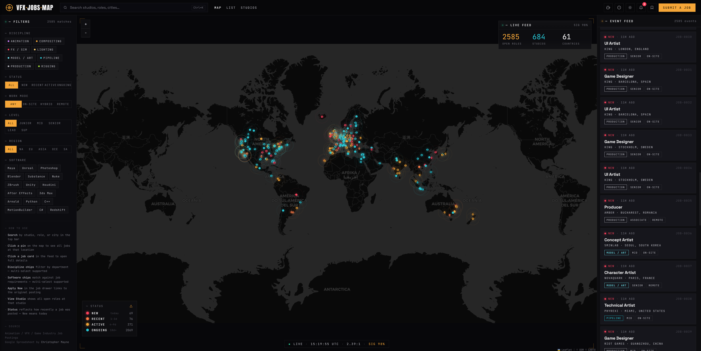

# VFX·JOBS·MAP

Live VFX job postings from around the world, plotted on an interactive map with filters, a live feed, sortable list, education resources, and curated industry links.



## Features

- **Interactive map** — Leaflet/CartoDB tiles, clustered pins color-coded by posting age
- **Filter rail** — discipline chips, featured-only, status, work mode, level, region, software stack, and free-text search
- **Job feed** — right-side panel sorted by featured status, then urgency (new → recent → active → ongoing)
- **List view** — sortable table with all open roles, CSV export
- **Studios view** — browse all studios and jump to their open roles
- **Edu view** — education resources with searchable school cards; click a card to open a detail drawer with an embedded mini-map
- **Links view** — curated industry websites (job boards and resources) in a sortable table; click any row to open the site
- **Job drawer** — details panel with Apply Now, Save, Applied, and Share buttons
- **My Jobs drawer** — saved and applied jobs in tabbed lists, persisted in `localStorage`
- **New jobs notifications** — red badge, auto-marks seen after 2 s
- **Light / dark mode** — smooth cross-fade via View Transitions API, applied to all map tiles including the edu mini-map
- **HUD** — live counts: open roles, studios, countries, signal quality, local time with timezone
- **Internationalisation** — 9 languages with auto-detection and a globe picker; all dynamic content re-renders on locale switch, including region filter labels
- **Mobile** — 5-tab bottom nav (Map, Filters, Feed, List, ···More) with overflow popup for Edu, Studios, and Links; bottom sheet panels in portrait, side-panel split in landscape

## Views

| View | Description |
|------|-------------|
| Map | Interactive world map with job pins |
| Filters | Discipline, featured-only, status, work mode, level, region, software filters |
| Feed | Featured-first job cards sorted by urgency |
| List | Sortable full table of filtered results with CSV export |
| Studios | All studios with open role counts |
| Edu | School and training resource cards with location mini-map |
| Links | Curated job boards and industry websites |

## Internationalisation

Language is auto-detected from the browser on first visit and persisted in `localStorage`. The globe icon in the toolbar opens the language picker.

| Code | Language |
|------|----------|
| `en` | English |
| `fr` | Français |
| `de` | Deutsch |
| `ja` | 日本語 |
| `ko` | 한국어 |
| `zh` | 简体中文 |
| `zh-TW` | 繁體中文 |
| `es` | Español |
| `ru` | Русский |

## Status color key

| Color | Label | Age |
|-------|-------|-----|
| 🔴 `#FF3D5A` | New | today |
| 🟠 `#FF7A3D` | Recent | 1–3 days |
| 🟡 `#F5A524` | Active | 4–9 days |
| 🔵 `#2BC4D2` | Ongoing | 10+ days |

## Data source

All data is pulled from a public Google Sheet via JSONP (compatible with `file://` origins where `fetch()` is blocked by CORS). Each sheet tab has a dedicated callback to avoid conflicts.

### Jobs sheet (default tab)

| Column | Field |
|--------|-------|
| 0 | Studio |
| 2 | City |
| 6 | Country |
| 8 | Job Title |
| 10 | Level |
| 12 | Work Mode |
| 14 | Date Posted |
| 16 | Contact |
| 18 | Software |
| 20 | Notes |
| 21 | Featured flag |
| 22 | Region |

### Education sheet (`gid=932464799`)

| Column | Field |
|--------|-------|
| 2 | School name |
| 4 | Country |
| 6 | City |
| 8 | State |
| 10 | Description |

### Links sheet (`gid=1290941975`)

| Column | Field |
|--------|-------|
| 2 | Site name |
| 4 | URL |
| 6 | Notes |

## Running locally

No build step. Just open `index.html` in a browser:

```
# Clone
git clone https://github.com/dsa146/vfxjobsmap.git
cd vfxjobsmap

# Open
open index.html        # macOS
start index.html       # Windows
xdg-open index.html    # Linux
```

All dependencies (Leaflet, Google Fonts) are loaded from CDN. No npm install required.

## Project structure

```
vfxjobsmap/
|-- index.html          # App shell and markup
|-- style.css           # All styles (dark/light themes, responsive layout)
|-- config.js           # Sheet IDs, column maps, disciplines, status constants
|-- coords.js           # City to lat/lng lookup table (CC and CO_LL objects)
|-- i18n.js             # Locale strings and language detection
|-- data.js             # Fetch constants, utilities, date helpers, sheet fetch/parse
|-- storage.js          # Saved jobs and notifications (localStorage, panels)
|-- app.js              # Shared constants, app state, and DOM cache
|-- map.js              # Leaflet map, tiles, markers, and popups
|-- feed.js             # Job feed rendering, infinite scroll, and HUD counts
|-- drawer.js           # Job drawer and education mini-map drawer
|-- filters.js          # Discipline/software chips and segmented filters
|-- navigation.js       # Top-level view switching
|-- views.js            # List, studios, education, and links views
|-- controls.js         # Search, theme, CSV export, language picker, signal/time
|-- mobile.js           # Mobile bottom navigation and sheets
`-- boot.js             # Theme init, data load, and startup orchestration
```

Scripts are loaded in dependency order from `index.html`. All share the global scope; no bundler is required.

## Tech stack

- [Leaflet 1.9](https://leafletjs.com/) — map rendering and edu mini-map
- [CartoDB Basemaps](https://github.com/CartoDB/basemap-styles) — dark/light tiles
- [Space Grotesk](https://fonts.google.com/specimen/Space+Grotesk) + [JetBrains Mono](https://fonts.google.com/specimen/JetBrains+Mono) + [Anton](https://fonts.google.com/specimen/Anton) — typography
- Vanilla JS / CSS — no framework, no build tool

## License

MIT
